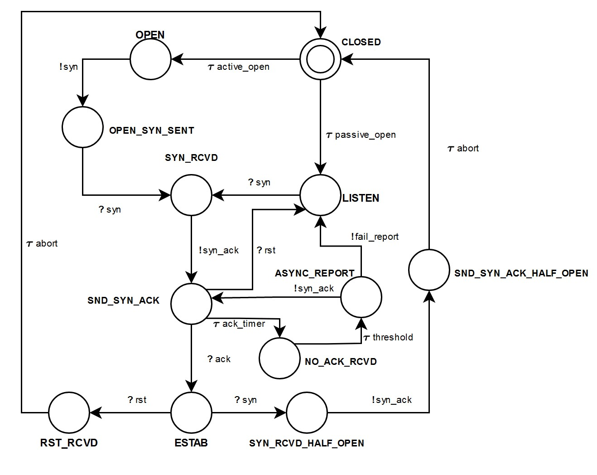
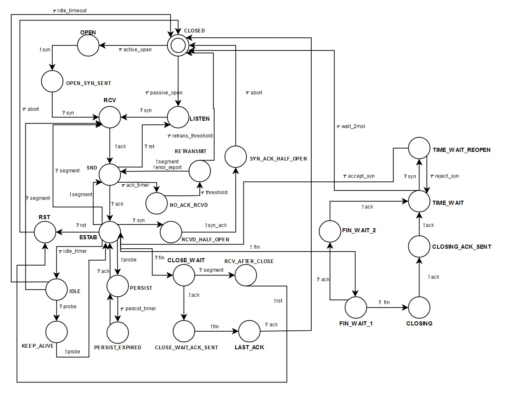
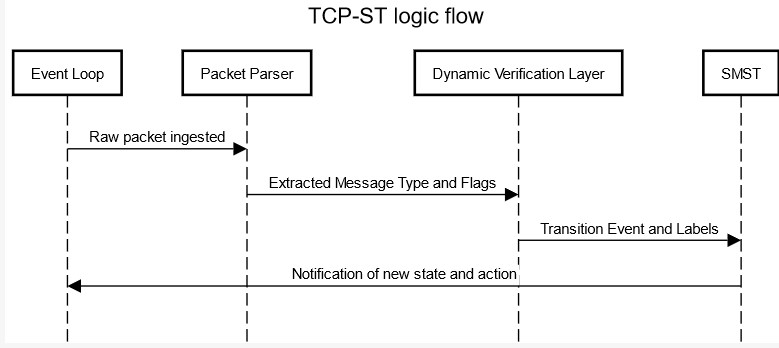

# TCP

 Notes on features of TCP and their modelling.

## General considerations

The modelling considerations are often described/noted in terms of session types. 
Despite this choice the modeling techniques could be viewed in the form of any formalism that can express the required actions.
The aim is specifically to model the communicating state machine.
There are parts of the protocol that are important but are outside the scope of the state machine, this is not to say that they should be ignored.
In these cases I referer to these features as outside considerations.
There are also features that may be "lifted" from the state machine to outside considerations.

There are also some general features and cases that apply to almost every part of the communication.
Without these the communication will simply not work or not be fully modeled, hence these are extracted here:

| Feature/Branch Case           | Model               |
| ----------------------------- | ------------------- |
| Unknown number of actions     | Unbounded recursion |
| Async Communication           | Async               |
| Connection loss/other failure | Failure             |

Notes:

* `Unknown number of actions`. We cannot know ahead of time how many times a server will need to recieve a packet, or how many times a client will need to send one. To model this we need some recursive environment that may be unbounded.
* `Async Communication`. Almost all parts of the data communication can happen asynchronously. Where a feature calls for explicit need for `Async` this will be noted. In particular:
  *    We have implicitly assumed an asynchronous user interface in which a SEND later elicits some kind of SIGNAL or pseudo-interrupt from the serving TCP endpoint.  An alternative is to return a response immediately.  For instance, SENDs might return immediate local acknowledgment, even if the segment sent had not been acknowledged by the distant TCP endpoint.  We could optimistically assume eventual success.  If we are wrong, the connection will close anyway due to the timeout.  In implementations of this kind (synchronous), there will still be some asynchronous signals, but these will deal with the connection itself, and not with specific segments or buffers.
* Connection loss/other failure. At any point in the protocol something may happen (e.g. device catches on fire) and the communication fails. Where there is an explicit sequence of actions that cause a `Failure` this will also be noted.

## Sequence Numbers

https://datatracker.ietf.org/doc/html/rfc9293#section-3.4

| Feature/Branch Case                               | Model                                             |
| ------------------------------------------------- | ------------------------------------------------- |
| Clock                                             | Outside Consideration                             |
| Keeping quiet when  assigning sequence numbers | Relative-Timed + Outside Consideration            |
| TCP Quiet Time Concept                            | ST-Primitives + Value Dependence + Relative-Timed |
| Source Address Validation                         | Outside Consideration                             |

  Notes:

  * `TCP Quiet Time Concept`. Need to keep track of the last sequence number, so `Value Dependence`. Hosts that for any reason lose knowledge of the last sequence numbers transmitted on each active (i.e., not closed) connection shall delay emitting any TCP segments for at least the agreed MSL in the internet system that the host is a part of, so `Relative-Timed`.
  * `Keeping quiet when assigning sequence numbers` - the TCP endpoint must keep quiet for an `MSL` before assigning any sequence numbers upon starting up or recovering from a situation where memory of sequence numbers in use was lost. From my understading, assigning a sequence number means generating (instantiating) it, so this is part of an outside algorithm. However, waiting for an `MSL` effects the communication.

## Connection establishment

https://datatracker.ietf.org/doc/html/rfc9293#section-3.5

| Feature/Branch Case                                          | Model                            |
| ------------------------------------------------------------ | -------------------------------- |
| Basic Three-Way Handshake  for Connection Synchronization | ST-Primitives + Value Dependence |
| Simultaneous open attempts                                   | ST-Primitives + Value Dependence |
| Recovery from Old Duplicate SYN                              | ST-Primitives + Value Dependence |
| Half-Open Connections                                        | ST-Primitives + Value Dependence |
| Old Duplicate SYN Initiates a Reset on Two Passive Sockets   | ST-Primitives + Value Dependence |
| Active Side Causes Half-Open Connection Discovery            | ST-Primitives + Value Dependence |

Notes:

* Abort states are explicit so can be modelled as `end`
* All have `Value Dependence` as `SEQ` and `ACK` fields are dependant
* A TCP implementation MUST support simultaneous open attempts (MUST-10)

## Reset Generation

https://datatracker.ietf.org/doc/html/rfc9293#section-3.5.2

| Feature/Branch Case                             | Model                            |
| ----------------------------------------------- | -------------------------------- |
| Connection does not exist                       | ST-Primitives + Value Dependence |
| Connection is in any  non-synchronized state | ST-Primitives + Value Depenednce |
| Connection is in a synchronized state           | ST-Primitives + Value Dependence |
| IP Security Compartment and Precedence          | Value Dependence                 |

Notes:

* All have `Value Dependence` due. In the first two cases the `SEQ` of the reset depends on the `ACK` field if `ACK` is set. On top of this, if the `ACK` field in not set then the the reset has sequence number zero and the ACK field is set to the sum of the sequence number and segment length of the incoming segment
* On `IP Security Compartment and Precedence` (https://datatracker.ietf.org/doc/html/rfc9293#appendix-A.1) - the Diffserv field value used in each direction is a part of the interface between TCP and the network layer, and values in use can be indicated both ways between TCP and the application.

## Reset Processing

https://datatracker.ietf.org/doc/html/rfc9293#section-3.5.3

| Feature/Branch Case      | Model                            |
| ------------------------ | -------------------------------- |
| Reset segment validation | ST-Primitives + Value Dependence |

Notes:

* `Value Dependence` due to `SEQ` field (used for validation) needing to be in the window.
* TCP implementations SHOULD allow a received RST segment to include data (SHLD-2).  It has been suggested that a RST segment could contain diagnostic data that explains the cause of the RST.  No standard has yet been established for such data.

## Closing a Connection

https://datatracker.ietf.org/doc/html/rfc9293#section-3.6

| Feature/Branch Case                                                 | Model                                             |
| ------------------------------------------------------------------- | ------------------------------------------------- |
| Recieve until told that  remote has closed                       | ST-Primitives + Failure                           |
| Signal that remote peer has closed                                  | ST-Primitives                                     |
| Reliably deliver all buffers sent   before connection was closed | ST-Primitives                                     |
| Initiate close                                                      | ST-Primitives                                     |
| Remote sends FIN control signal                                     | ST-Primitives + Failure                           |
| Simultaneous close                                                  | ST-Primitives                                     |
| Half-duplex close sequence                                          | ST-Primitives                                     |
| Active close time lingering                                         | ST-Primitives + Relative-Timed + Value Dependence |
| Timestamp Options                                                   | ST-Primitives + Value Dependence                  |

Notes:

* `Relative-Timed` for `Active close time lingering`: When a connection is closed actively, it MUST linger in the `TIME-WAIT` state for a time `2xMSL` (Maximum Segment Lifetime) (MUST-13). However, it MAY accept a new SYN from the remote TCP endpoint to reopen the connection directly from `TIME-WAIT` state (MAY-2). This happens if it assigns its initial sequence number for the new connection to be larger than the largest sequence number it used on the previous connection incarnation, and returns to `TIME-WAIT` state if the SYN turns out to be an old duplicate.
* `Timestamp Options` (https://datatracker.ietf.org/doc/html/rfc6191). `Value Dependence` as new `Timestamp` field would cause dependencies and dictate state transitions. This algorithm for reducing TIME-WAIT is a Best Current Practice that SHOULD be implemented since Timestamp Options are commonly used, and using them to reduce TIME-WAIT provides benefits for busy Internet servers (SHLD-4).

## Segmentation

https://datatracker.ietf.org/doc/html/rfc9293#section-3.7

| Feature/Branch Case                                                                                | Model                                    |
| -------------------------------------------------------------------------------------------------- | ---------------------------------------- |
| Maximum Segment Size Option                                                                        | Outside Consideration                    |
| Path MTU Discovery                                                                                 | Outside Consideration                    |
| PMTUD for IPv4                                                                                     | Outside Consideration                    |
| PMTUD for IPv6                                                                                     | Outside Consideration                    |
| PLPMTUD                                                                                            | Outside Consideration                    |
| Smallest effective MTU of the interface to calculate   the value to advertise in the MSS Option | Outside Consideration                    |
| Nagle Algorithm                                                                                    | Value Dependence + Outside Consideration |
| IPv6 Jumbograms                                                                                    | Outside Consideration                    |

Notes:

* Maximum Segment Size Option. TCP endpoints MUST implement both sending and receiving the MSS Option (MUST-14).  TCP implementations SHOULD send an MSS Option in every SYN segment when its receive MSS differs from the default 536 for IPv4 or 1220 for IPv6 (SHLD-5), and MAY send it always (MAY-3). As these values do not affect the actual state of communication, the algorithm for their calculation is an `Outside Consideration`.
* Path MTU Discovery. A TCP implementation may be aware of the MTU on directly connected links.
* PMTUD for IPv4/IPv6 and PLPMTUD. The mechanisms in all four of these RFCs are recommended to be included in TCP implementations. Same reasoning as above for `Outside Consideration`.
* TCP implementations SHOULD use the smallest effective MTU of the interface to calculate the value to advertise in the MSS Option (SHLD-6). `Outside Consideration` for same reasons as above.
* Nagle Algorithm. A TCP implementation SHOULD implement the Nagle algorithm to coalesce short segments (SHLD-7).  However, there MUST be a way for an application to disable the Nagle algorithm on an individual connection (MUST-17). `Value Dependence` as we need to check if there is unacknowledged data based on `SND`. `Outside Consideration` as the buffering can be done outside the state machine and as the algorithm would be implemented externally.
* IPv6 Jumbograms. `Outside Consideration` for same reasons as above. In order to support TCP over IPv6 Jumbograms, implementations need to be able to send TCP segments larger than the 64-KB limit that the MSS Option can convey.

## Data communication

https://datatracker.ietf.org/doc/html/rfc9293#section-3.8

| Feature/Branch Case                                                                     | Model                                                                         |
| --------------------------------------------------------------------------------------- | ----------------------------------------------------------------------------- |
| Retransmission Timeout                                                                  | ST-Primitives + Value Dependence + Relative-Timed + Outside Consideration     |
| Same IPv4 Identification field   if retransmitted packet is identical                | Value Dependence                                                              |
| Excessive retransmissions of data segments                                              | ST-Primitives + Multiplicities/Relative-Timed + Outside Consideration + Async |
| Idling                                                                                  | Relative-Timed                                                                |
| Keep-alives                                                                             | ST-Primitives + Outside Consideration                                         |
| Support for the urgent mechanism                                                        | ST-Primitives + Outside Consideration/Priority-Ordering                       |
| Sequence of urgent data of any length                                                   | Outside Consideration                                                         |
| Inform the application layer asynchronously   whenever it receives an urgent pointer | ST-Primitives + Async                                                         |
| Provide a way for the application to learn how   much urgent data remains to be read | ST-Primitives + Outside Consideration                                         |
| Zero-Window Probing                                                                     | ST-Primitives + Relative-Timed                                                |
| Silly Window Syndrome Avoidance                                                         | ST-Primitives + Outside Consideration                                         |
| Delayed Acknowledgments                                                                 | Async + Relative-Timed                                                        |

Notes:

* Retransmission Timeout. `Value Dependence` as many things depent on the `RTT` measurement that is made dynamically. `Relative-Timed` as this imposes a timing restriction on the communication - an implementation MUST manage the retransmission timer(s) in such a way that a segment is never retransmitted too early. `Outside Consideration` as Karn's algorithm (MUST-18) would be done outside of the state machine. This is quite a complex set of requirements so lifting *all* of this outside of the state machine and typesystem may be the best way to go.
* Same IPv4 Identification field   if retransmitted packet is identical. `Value Dependence` as we need to check if the retransmitted packet is identical. This also requires some sort of equality operator on these types.This is (MAY-4).
* Excessive retransmissions of data segments. Here we can use `Multiplicities` or `Relative-Timed` as R1 and R2 might be measured in time units or as a count of retransmissions. `Outside Consideration` as an application MUST (MUST-21) be able to set the value for R2 for a particular connection. Explicit `Async` as TCP implementations SHOULD inform the application of the delivery problem (unless such information has been disabled by the application; see the "Asynchronous Reports" section). The value of R1 SHOULD correspond to at least 3 retransmissions, at the current RTO (SHLD-10).  The value of R2 SHOULD correspond to at least 100 seconds (SHLD-11). SYN retransmissions MUST be handled in the general way just described for data retransmissions, including notification of the application layer.
* Idling. A TCP connection is said to be "idle" if for some long amount of time there have been no incoming segments received and there is no new or unacknowledged data to be sent.
* Keep-alives. Implementers MAY include "keep-alives" in their TCP implementations (MAY-5), although this practice is not universally accepted. If keep-alives are included, the application MUST be able to turn them on or off for each TCP connection (MUST-24), and they MUST default to off (MUST-25). Keep-alive packets MUST only be sent when no sent data is outstanding, and no data or acknowledgment packets have been received for the connection within an interval (MUST-26).  This interval MUST be configurable (MUST-27) and MUST default to no less than two hours (MUST-28).  An implementation SHOULD send a keep-alive segment with no data(SHLD-12); however, it MAY be configurable to send a keep-alive segment containing one garbage octet (MAY-6).
* Support for the urgent mechanism. If some urgent data transmission starts I assume we should re-order the communication so that these packets come first. This means that all the previous packets will be put on hold. From the point of the session typed state machine this is still just a recursive envirionment though, so which packets are urgent and which are not is an `Outside Consideration`. However, we may wish for this to be explicit in the typesystem and lower this to the level of the state machine, so `Priority-Ordering`.
* Sequence of urgent data of any length. A TCP implementation MUST support a sequence of urgent data of any length (MUST-31). The urgent pointer MUST point to the sequence number of the octet following the urgent data (MUST-62).
* Inform the application layer asynchronously. A TCP implementation MUST (MUST-32) inform the application layer asynchronously whenever it receives an urgent pointer and there was previously no pending urgent data, or whenever the urgent pointer advances in the data stream. 
* How much data remains.The TCP implementation MUST (MUST-33) provide a way for the application to learn how much urgent data remains to be read from the connection, or at least to determine whether more urgent data remains to be read.
* Probing of zero (offered) windows MUST be supported (MUST-36). A TCP implementation MAY keep its offered receive window closed indefinitely (MAY-8).  As long as the receiving TCP peer continues to send acknowledgments in response to the probe segments, the sending TCP peer MUST allow the connection to stay open (MUST-37). The transmitting host SHOULD send the first zero-window probe when a zero window has existed for the retransmission timeout period (SHLD-29) - `Relative-Timed`. And SHOULD increase exponentially the interval between successive probes - `Relative-Timed`.
* A TCP implementation MUST include a SWS avoidance algorithm in the sender (MUST-38).
 
## TCP Congestion Control

Generally, congestion control algorithms involve *many* semantics that can be labeled as `Outside Consideration` and significatly increase the complexity of a TCP implementation.

https://datatracker.ietf.org/doc/html/rfc9293#section-3.8.2
https://datatracker.ietf.org/doc/html/rfc5681
https://datatracker.ietf.org/doc/html/rfc3168
https://datatracker.ietf.org/doc/html/rfc1122

| Feature/Branch Case                                 | Model                                                  |
| --------------------------------------------------- | ------------------------------------------------------ |
| Slow start                                          | ST-Primitives + Outside Consideration + Relative-Timed |
| Congestion avoidance                                | ST-Primitives + Outside Consideration + Relative-Timed |
| Fast retransmit                                     | ST-Primitives + Outside Consideration                  |
| Fast recovery                                       | ST-Primitives + Outside Consideration                  |
| Restarting Idle Connections                         | Outside Consideration                                  |
| Generating Acknowledgments                          | ST-Primitives + Relative-Timed + Outside Consideration |
| Immediately acknowledge out of order segments       | Outside Consideration                                  |
| Determine that all of the endpoints are ECN-capable | ST-Primitives                                          |
| Inform the data sender of the received CE packet    | ST-Primitives                                          |

Note:

* Slow start and Congestion avoidance. These generally determine some value that is outside of the scope of the state machine but also depend on the retransmission timer which *could* be managed by the state machine. If the clock is outside then this is all just `Outside Consideration`.
* Fast retransmit and Fast recovery. Both of these need to check for duplicate `ACK` but this just means we need to keep track of `ACK` received, not that some value is constrained by another, so its a `Outside Consideration`.

## Modeling tags

| Tag                   | Note                                                                                                                                                                                                                                                                                                                                                                                                                                                                             |
| --------------------- | -------------------------------------------------------------------------------------------------------------------------------------------------------------------------------------------------------------------------------------------------------------------------------------------------------------------------------------------------------------------------------------------------------------------------------------------------------------------------------- |
| ST-Primitives         | Primitives session type operations.   I.e. `&, ⊕, ?, !, end`.                                                                                                                                                                                                                                                                                                                                                                                                                 |
| Value Dependence      | The protocol depends on a constraint on a value imposed by another specific value, e.g. the check for the incrementing of sequence numbers depends on the actual value.   This means we can either parse a packet, and do this check outside of the formal state machine or the formalism needs to be able to do value dependent typing. In the case where we lift this to an outside algorithm this becomes an `Outside Consideration`.                                      |
| Failure               | Indicates that a an action was performed but failed. The modelling of this depends on what failure entails. This could be a timeout or some sort of explicit error from I/O.                                                                                                                                                                                                                                                                                                     |
| Relative-Timed        | Explicit time bounds such as ones required by the `TIME-WAIT` state. Relative here simply signifies that the time is not absoolute from some start point, i.e. it is not that we have a communication that must happen in some number of time units. This can be lifted from the state machine and handled by some abstract clock. In this case this would become an `Outside Consideration` and the state machine would only need to be informed when it can perform an action. |
| Unbounded recursion   | Unbounded recursion is when we can't predict the number of repetitions for a recursive function/action.                                                                                                                                                                                                                                                                                                                                                                          |
| Multiplicities        | We may want to count the number of times a certain message has been sent or communication channel has been used. This can also be lifted to `Outside Consideration` by e.g. keeping some variable that tracks a count externally.                                                                                                                                                                                                                                                |
| Async                 | Asynchronous communication, usually through some message buffer. Lifting this to `Outside Consideration` may be very tricky.                                                                                                                                                                                                                                                                                                                                                     |
| Priority-Ordering     | We may wish some messages to have higher priority, so when these come in, and we have some messages left to buffer, we will put the priority ones on top. This tag only really makes sense with `Async` as otherwise we process packets synchronously anyway. This may be lifted entirely out of the state machine, in which case, the state machine will be completely oblivious to any urgency mechanisms and this will be an `Outside Consideration`.                         |
| Outside Consideration | A feature that relies on an algorithm that is outside the consideration of the actual communication/state machine. For example, the algorithm for generating initial sequence numbers is precisely defined and required, however, this is outside the bounds of the communication protocol.                                                                                                                                                                                      |

## On the retransmission queue

Can't seem to find an explicit definition and the requirements for the retransmission queue.
For now, assume that this is just some queue on which we push messaged to be retransmitted at some point.
In this case this would be handled by `Async`.

## One big table

Just a collation of all the feature tables.

| Feature/Branch Case                                                                                | Model                                                                         |
| -------------------------------------------------------------------------------------------------- | ----------------------------------------------------------------------------- |
| Unknown number of actions                                                                          | Unbounded recursion                                                           |
| Async Communication                                                                                | Async                                                                         |
| Connection loss/other failure                                                                      | Failure                                                                       |
| Clock                                                                                              | Outside Consideration                                                         |
| Keeping quiet when  assigning sequence numbers                                                  | Relative-Timed + Outside Consideration                                        |
| TCP Quiet Time Concept                                                                             | ST-Primitives + Value Dependence + Relative-Timed                             |
| Source Address Validation                                                                          | Outside Consideration                                                         |
| Basic Three-Way Handshake  for Connection Synchronization                                       | ST-Primitives + Value Dependence                                              |
| Simultaneous open attempts                                                                         | ST-Primitives + Value Dependence                                              |
| Recovery from Old Duplicate SYN                                                                    | ST-Primitives + Value Dependence                                              |
| Half-Open Connections                                                                              | ST-Primitives + Value Dependence                                              |
| Old Duplicate SYN Initiates a Reset on Two Passive Sockets                                         | ST-Primitives + Value Dependence                                              |
| Active Side Causes Half-Open Connection Discovery                                                  | ST-Primitives + Value Dependence                                              |
| Connection does not exist                                                                          | ST-Primitives + Value Dependence                                              |
| Connection is in any  non-synchronized state                                                    | ST-Primitives + Value Depenednce                                              |
| Connection is in a synchronized state                                                              | ST-Primitives + Value Dependence                                              |
| IP Security Compartment and Precedence                                                             | Value Dependence                                                              |
| Reset segment validation                                                                           | ST-Primitives + Value Dependence                                              |
| Recieve until told that  remote has closed                                                      | ST-Primitives + Failure                                                       |
| Signal that remote peer has closed                                                                 | ST-Primitives                                                                 |
| Reliably deliver all buffers sent   before connection was closed                                | ST-Primitives                                                                 |
| Initiate close                                                                                     | ST-Primitives                                                                 |
| Remote sends FIN control signal                                                                    | ST-Primitives + Failure                                                       |
| Simultaneous close                                                                                 | ST-Primitives                                                                 |
| Half-duplex close sequence                                                                         | ST-Primitives                                                                 |
| Active close time lingering                                                                        | ST-Primitives + Relative-Timed + Value Dependence                             |
| Timestamp Options                                                                                  | ST-Primitives + Value Dependence                                              |
| Maximum Segment Size Option                                                                        | Outside Consideration                                                         |
| Path MTU Discovery                                                                                 | Outside Consideration                                                         |
| PMTUD for IPv4                                                                                     | Outside Consideration                                                         |
| PMTUD for IPv6                                                                                     | Outside Consideration                                                         |
| PLPMTUD                                                                                            | Outside Consideration                                                         |
| Smallest effective MTU of the interface to calculate   the value to advertise in the MSS Option | Outside Consideration                                                         |
| Nagle Algorithm                                                                                    | Value Dependence + Outside Consideration                                      |
| IPv6 Jumbograms                                                                                    | Outside Consideration                                                         |
| Retransmission Timeout                                                                             | ST-Primitives + Value Dependence + Relative-Timed + Outside Consideration     |
| Same IPv4 Identification field   if retransmitted packet is identical                           | Value Dependence                                                              |
| Excessive retransmissions of data segments                                                         | ST-Primitives + Multiplicities/Relative-Timed + Outside Consideration + Async |
| Idling                                                                                             | Relative-Timed                                                                |
| Keep-alives                                                                                        | ST-Primitives + Outside Consideration                                         |
| Support for the urgent mechanism                                                                   | ST-Primitives + Outside Consideration/Priority-Ordering                       |
| Sequence of urgent data of any length                                                              | Outside Consideration                                                         |
| Inform the application layer asynchronously   whenever it receives an urgent pointer            | ST-Primitives + Async                                                         |
| Provide a way for the application to learn how   much urgent data remains to be read            | ST-Primitives + Outside Consideration                                         |
| Zero-Window Probing                                                                                | ST-Primitives + Relative-Timed                                                |
| Silly Window Syndrome Avoidance                                                                    | ST-Primitives + Outside Consideration                                         |
| Delayed Acknowledgments                                                                            | Async + Relative-Timed                                                        |
| Slow start                                                                                         | ST-Primitives + Outside Consideration + Relative-Timed                        |
| Congestion avoidance                                                                               | ST-Primitives + Outside Consideration + Relative-Timed                        |
| Fast retransmit                                                                                    | ST-Primitives + Outside Consideration                                         |
| Fast recovery                                                                                      | ST-Primitives + Outside Consideration                                         |
| Restarting Idle Connections                                                                        | Outside Consideration                                                         |
| Generating Acknowledgments                                                                         | ST-Primitives + Relative-Timed + Outside Consideration                        |
| Immediately acknowledge out of order segments                                                      | Outside Consideration                                                         |
| Determine that all of the endpoints are ECN-capable                                                | ST-Primitives                                                                 |
| Inform the data sender of the received CE packet                                                   | ST-Primitives                                                                 |

## State machine diagrams

A state machine diagram for establishing a connection in TCP from the viewpoint of the server.

The transitions are labelled via the following actions:

* `!` - a message is sent to the other participant
* `?` - a message is recieved from the other participant
* `𝜏` - silent tranisition, i.e. an action that advances the state machine but is not visible to the other participant

A state machine diagram for TCP with possible half close connections is below:

## Data flow

Approximate data flow between moment of packet ingestion and state tranisition:

## Interfaces

Current implmenetation of STs has:

* `send` that wraps a send function and fires a send tranisiton
* `recv` that wraps a recv function and fires a recv tranisition
* `offer` that needs a function that will at some point emit a choice
* `choose` that just picks the choice it wants

Hence, the dynamic verification layer will own objects that can interract with the SMST layer.
The layer above SMST needs to know which tranisition it think should happen and comapre this with the tranistion in SMST.
This layer also needs functions that can proivide the choice emition for `offer`.
If SMST at any point can not accept the transition then it should halt as desynchronized and should probably abort.

## MPST model

### Summary

Mechanisms the model covers:

* Connection Establishment
    * Recovering from duplicate SYNs
    * Half-Open
* Reset-Generation
* Closing connection
    * Local user inits
    * Remote inits
    * Simul. close
    * Aborts
    * Half-duplex
    * Linger in TIME-WAIT
* Handling excessive re-transmission
* Async reports
* TCP Keep-Alives
* Zero-Window Probing

As noted in the breakdown, there are mechanisms where a more descriptive payload type
can implicitly describe what is going on.
This does not capture the full semantics of e.g. congestion control though.

### Breakdown

* Sequence number comparisons

RFC9293: 3.4. Sequence Numbers - The typical kinds of sequence number comparisons that the TCP implementation must perform.

Inclusion: Irrelevant to STs.

* Initial sequence number selection

RFC9293: 3.4.1 - A TCP implementation MUST use the above type of "clock" for clock-driven selection of initial sequence numbers.

Inclusion: Irrelevant to STs.

* Knowing when to keep quiet

RFC9293: 3.4.2

Inclusion: Irrelevant according to RFC9293.

* TCP Quiet Time Concept

RFC9293: 3.4.3

Inclusion: Exclude - calculus has no way of encoding delaying message transmission.

* Connection Establishment: simple 3WHS

RFC9293: 3.5 Fig6

Inclusion: Must have.

* Connection Establishment: Simul. Open

RFC9293: 3.5 Fig7

Inclusion: Could have (RFC9293 mentions this as a MUST)

* Connection Establishment: Keep track of passive vs active

RFC9293: 3.5 - TCP implementation MUST keep track of whether a connection has reached SYN-RECEIVED state as the result of a passive OPEN or an active OPEN.

Inclusion: Irrelevant to STs.

* Connection Establishment: Recovering from OLD Duplicate SYN

RFC9293: 3.5 Fig8

Inclusion: Could have.

* Connection Establishment: Half-Open connection

RFC9293: 3.5 Fig9

Inclusion: Could have.

* Connection Establishment: Active Side Causes Half-Open Connection Discovery

RFC9293: 3.5 Fig10

Inclusion: Could have.

* Connection Establishment: Old Duplicate SYN Initiates a Reset on Two Passive Sockets

RFC9293: 3.5 Fig11

Inclusion: Could have.

* Reset Generation: connection does not exist

RFC9293: 3.5.2 - If the connection does not exist (CLOSED), then a reset is sent in response to any incoming segment except another reset.

Inclusion: Could have. Part about where the reset takes its seq number from is irrelevant.

* Reset Generation: non-synchronised state

RFC9293: 3.5.2 - If the connection is in any non-synchronised state (LISTEN, SYN-SENT, SYN-RECEIVED), and the incoming segment acknowledges something not yet sent (the segment carries an unacceptable ACK), or if an incoming segment has a security level or compartment (Appendix A.1) that does not exactly match the level and compartment requested for the connection, a reset is sent.

Inclusion: Could have. The actual checks are dynamic. 

* Reset Generation: synchronised state

RFC9293: 3.5.2 - If an incoming segment has a security level or compartment that does not exactly match the level and compartment requested for the connection, a reset is sent and the connection goes to the CLOSED state. The reset takes its sequence number from the ACK field of the incoming segment.

Inclusion: Could have. The actual checks are dynamic.

* Reset Processing: validation

RFC9293: 3.5.3

Inclusion: Exclude - dynamic check.

* Reset Processing: RST segment includes data

RFC9293: 3.5.3 - TCP implementations SHOULD allow a received RST segment to include data.

Inclusion: Irrelevant to STs.

* Closing a Connection: local user initiates the close

RFC9293: 3.6 Case 1.

Inclusion: Must have.

* Closing a Connection: remote TCP endpoint initiates by sending a FIN

RFC9293: 3.6 Case 2.

Inclusion: Must have.

* Closing a connection: simul. close

RFC9293 3.6 Case 3.

Inclusion: Could have.

* Closing a connection: "abort"

RFC9293: 3.6 - (2) an "abort" in which one or more RST segments are sent and the connection state is immediately discarded.

Inclusion: Could have. I think this is already covered in the reset processing.

* Closing a connection: Half-duplex

RFC9293: 3.6.1

Inclusion: Could have.

* Closing a connection: linger in TIME-WAIT

RFC9293: 3.6.1

Inclusion: Must have. Can be modelled via a time-out branch. I.e., TIME-WAIT state is a timeout branch where the timeout causes close.

Overarching question about Magpi: how do timeout branches specify what the timeout period is?

* Closing a connection - Reducing the TIME-WAIT State Using TCP Timestamps

RFC6191

Inclusion: Irrelevant to STs.

* Sending and receiving the MSS Option

RFC9293: 3.7.1 - TCP endpoints MUST implement both sending and receiving the MSS Option (MUST-14).

Inclusion: Irrelevant to STs.

* Send an MSS Option in every SYN segment when MSS differs and may send always

RFC9293: 3.7.1 - TCP implementations SHOULD send an MSS Option in every SYN segment when its receive MSS differs from the default 536 for IPv4 or 1220 for IPv6 (SHLD-5), and MAY send it always (MAY-3).

Inclusion: Irrelevant to STs.

* Assume default MSS Option if MSS Option not received

RFC9293: 3.7.1 - If an MSS Option is not received at connection setup, TCP implementations MUST assume a default send MSS of 536 (576 - 40) for IPv4 or 1220 (1280 - 60) for IPv6 (MUST-15).

Inclusion: Irrelevant to STs.

* Maximum size of a segment TCP endpoint sends

RFC9293 3.7.1 - The maximum size of a segment that a TCP endpoint really sends, the "effective send MSS", MUST be the smaller (MUST-16) of the send MSS (that reflects the available reassembly buffer size at the remote host, the EMTU_R [19]) and the largest transmission size permitted by the IP layer (EMTU_S [19]).

Inclusion: Irrelevant to STs.

* Path MTU Discovery

RFC9293: 3.7.2

Inclusion: Irrelevant to STs.

* Nagle Algorithm

RFC9293: 3.7.4

Inclusion: Can be "implicitly" represented via payload types but actual semantics not possible.

* IPv6 Jumbograms

RFC9293: 3.7.5

Inclusion: Irrelevant to STs.

* Computing Re-transmission Timer

RFC6298

Inclusion: Irrelevant to STs.

* Karn's algorithm

RFC6298

Inclusion: See below.

* Slow start

RFC5681

Inclusion: See below.

* Congestion avoidance

RFC5681

Inclusion: See below.

* Exponential Backoff:

RFC5681

Inclusion: See below.

* ECN

RFC3168

Inclusion: See below.

Generally we can describe these semantics via payload types.
E.g. we could type some payload as SEGMENT_WITH_SMSS_OVER_2190 and assume the parser does this correctly.
What this gives us is the ability to check that in this given branch we get this payload type.
Unclear how well this actually represents what is happening in e.g. congestion control.

* Excessive re-transmission of the same segment

RFC9293: 3.8.3

Inclusion: Can include, a few ideas for modelling this:

* The difference between R1 and R2 can be the nesting level of re-transmission branch
* Timeout branch
* Value dependent typing

* Inform the application of delivery problems

RFC9293: 3.9.1.8

Inclusion: Can include.

* R2 must be set large enough to provide re-transmission of the segment for at least 3 mins.

RFC9293: 3.8.3

Inclusion: Irrelevant to STs.

* TCP Keep-Alives

RFC9293: 3.8.4

Inclusion: Can include.

* Support for the TCP urgent information mechanism

RFC9293: 3.8.5

Inclusion: Seems irrelevant to STs.

* TCP must be robust against window shrinking

RFC9293: 3.8.6.2.1

Inclusion: Can include.

* Zero-Window Probing

RFC9293: 3.8.6.1

Inclusion: Can include.

* SWS - senders algorithm

RFC9293: 3.8.6.2.1

Inclusion: Irrelevant to STs.

* SWS - receivers algorithm

RFC9293: 3.8.6.2.2

Inclusion: Irrelevant to STs.

* Delayed ACKs

RFC9293: 3.8.6.3

Inclusion: Irrelevant to STs.

